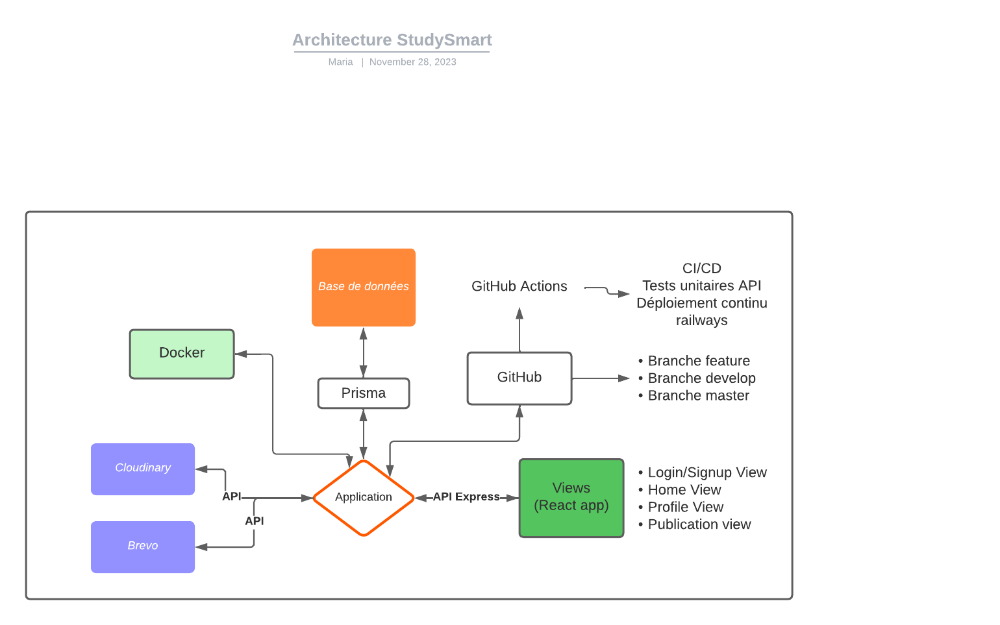
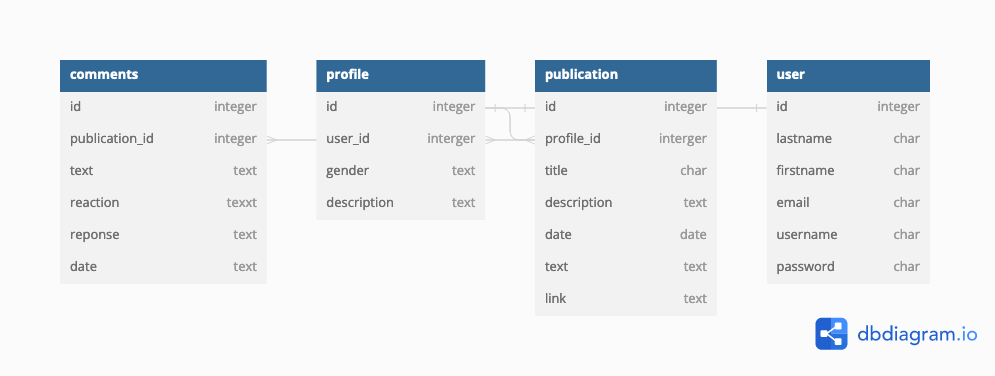

# Exemple de cahier des charges techniques

- [Cahier des charges techniques - StudySmart](#cahier-des-charges-techniques-studysmart)
  - [Produit](#produit)
  - [Equipe](#equipe)
  - [Stack](#stack)
  - [Bonnes pratiques](#bonnes-pratiques)
    - [Tests](#tests)
    - [Variable d'environnements](#variable-denvironnements)
    - [CI/CD](#cicd)
    - [Git](#git)
    - [Design Pattern](#design-pattern)
  - [Choix techniques](#choix-techniques)
    - [Frontend](#frontend)
    - [Backend](#backend)
  - [Schéma de l'application](#schéma-de-lapplication)
  - [Schéma de la base de données](#schéma-de-la-base-de-données)
  - [Documentation API](#documentation-api)
  - [Outils gestion de projet](#outils-gestion-de-projet)

## Produit

Notre produit est un outil de veille pour aider les étudiants en tech à partager leur veille.

## Equipe

Notre équipe est composée de :

- 3 développeurs front-end
- 2 développeurs back-end
- 1 lead-developpeur / devops

## Stack

Notre Stack technique est composée de :

- Frontend : [React]
- Backend : [NodeJS] - [Express]
- BDD : [MySQL] ([Prisma])
- Ops : [Docker] + Github Actions

## Bonnes pratiques

- Nous utilisons une approche clean code.

### Tests

- Jest

### Variable d'environnements

Les variables d'environnements sont stockés en local dans un fichier .env

### CI/CD

Mise en place d'une intégration continue avec le lancement de tests de l'api dès un push sur le dépôt distant et un déploiement continu avec le redéploiement du back dès qu'il est merge sur master

### Git

- Chaque nouvelle feature fait l'object d'une branche
- Quand la feature est terminée, la branche est poussée sur le repo distant
- Une pull request est faite sur la branche develop afin de tester l'application
- La branche develop est mergé dans la branche master une fois les tests terminées

### Design Pattern

- MVC

## Choix techniques

### Frontend

Nos possibilités étaient :

- Front end Vanilla (HTML, CSS, JavaScript)
- [React]

| Nom   | Connaissance | Envie | Documentation | Commentaires              |
| ----- | ------------ | ----- | ------------- | ------------------------- |
| React | 4/5          | 4/5   | 4/5           | Connus par toute l'équipe |

- Nous implémentons React pour le front de l'application afin de structurer notre code en composants réutilisables dans differentes parties. React permet également une nvaigation rapide entre les différentes pages grâce au Client Side Rendering.

### Backend

Nos possibilités étaient :

- [Node] - [Express]
- PHP

| Nom  | Connaissance | Envie | Documentation | Commentaires             |
| ---- | ------------ | ----- | ------------- | ------------------------ |
| Node | 3/5          | 4/5   | 4/5           | Maitrisé par 3 personnes |
| PHP  | 4/5          | 3/5   | 4/5           | Maitrisé par 2 personnes |

- Nous implémentons Node/Express pour la création du serveur virtuel afin d'assurer une rapidité d'exécution des requêtes en asynchrone, ce que PHP ne permet pas.
- Nous utiliserons Prisma pour effectuer les requêtes SQL afin de faciliter et rendre plus lisibles les requêtes vers la base de données.

## Schéma de l'application

## Schéma de la base de données

s

## Documentation API

Voir api.json (Swagger)

## Outils gestion de projet

- Figma
- Trello
- GitHub
- Swagger
